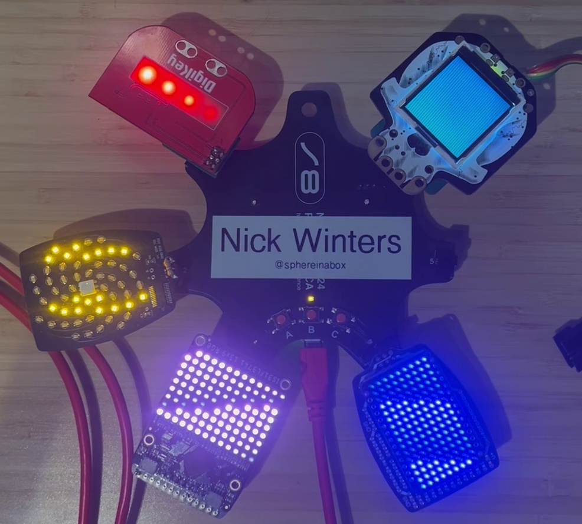

# 2024 Position Synchronized Badge Animations

Animated LEDs across multiple SAOs coordinated with the position of every LED on each SAO.

As demoed in the badge hack competition:
- Coordinated animation across the LEDs of 4 SAOs, which include the transformation each SAO is mounted in the animation like the SAO are part of one large display
- 5 Animations: X waves, Y waves, concentric waves, radial waves, and plasma
- Detects the location each SAO is mounted
- 2 new SAOs built from SAO "petal" protoboards and off-the-shelf adafruit LED arrays and breakout boards
- Digikey SAO from 2019 supercon fixed to plug in with shim PCB, and programmed to have LEDs controlled over i2c

The SAOs are:
1. 2019 supercon DigiKey SAO, has atmel SAMD11C18A, re-programmed
2. 2024 supercon "Petal matrix". A multi-spiral array of 56 amber LEDs and a RGB LED driven by 7-segment i2c driver chip AS1115
3. 2024 supercon "Pure Proto Petal" with added adafruit 5201 IS31FL3741 13x9 PWM RGB LED matrix driver
4. 2024 supercon "Pure Proto Petal" with added adafruit 2973 9x16 blue charlieplex matrix and adafruit 2946 IS31FL3731 charlieplex 16x9 matrix driver
5. (not in hack presentation) Adafruit 3900 HalloWing M0 express from a previous supercon, adapted into SAO using boards I made. 

# Controls
The buttons badge buttons switch the active animation.
- A button switches to plasma animation
- B button switches to linear X animation, or between linear X and Y animations
- C button switches to concentric wave animation, or between concentric waves and spinning waves

# Code introduction
Current code in my-micropython folder.

- boot.py has been modified with additional code to scan which SAO IO pins are connected to what
- main.py has all the new animations, and the transforms of each SAO port
- SAO-specific files each know where on the individual SAO the LEDs are, and how to talk to them by i2c
  - dksao.py for DigiKey SAO
  - petalsao.py for 2024 Petal Matrix SAO
  - sixteen9sao.py for 16x9 charlieplex matrix
  - thirteen9sao.py for 13x9 RGB matrix

The remaining code is either old test code, or came with the badge.

# Coordinate transformations
The SAO LED locations are positioned in mm, relative to the SAO connector. With the SAO connector key on top, the positive X direction is to the right, and I think the positive Y direction is up.

For the petal matrix I pulled the LED locations from the placement file and converted to mm, and offset by the SAO connector origin by measuring the design file in inkscape or gerber viewer. I mapped the LEDs to which digit and segment pins by hand to create a map for that SAO.

The locations and orientations of the badge SAO connector were similarly semi-manually found. Starting from I think the PDF of the badge files I located the SAO connectors pin 1 and 5 to find the location of pin 1, and the orientation of it, which was used to find the center. See badge/Badge SAO connector locations.ods

So then when creating the SAO instance, the transformation from SAO to badge position is passed in and the LED positions are rotated and translated to where they are on the badge.

Then the animation is just a function of the X,Y position, returning a float from 0..1, which is then converted to an intensity, depending on each display for how to do that.

# Identifying SAO locations
badge.py has been modified to look for which SAO GPIO pins are pulled high or low. I've also written code to check for which SAO GPIO pins are jumpered to sda and scl pins, but that's not active.

The SAOs pictured have the following jumpers or pullup/pulldown added:
- DK SAO has jumper on IO1/IO2 pins going to badge. The pins going to the SAO are disconnected so I can reprogram it (they're swd/swclk)
- Petal matrix has 4.7k resistor between GND and IO2
- 13x9 RGB: IO1 jumpered to IO2 then 4.7k resistor to 3v3
- 16x9 charlieplex: IO1 3v3 with 4.7k resistor
- HalloWing M0: IO1 pulled to gnd with 4.7k resistor

# Known bugs / future potential development
- The badge scan probably doesn't reliably un-wedge i2c bus I2C1 likely because of copy/paste error, so sometimes unplugging SAO causes animation to stop instead of continuing on remaining SAO
- There isn't a way to force detecting SAO again without power cycle
- The RGB array doesn't do RGB
- It could probably be even brighter. As shown it would draw nearly 2W if powered by USB 5V
- The petal matrix SAO of the SAO sometimes seems to have both IO1 and IO2 jumpered to GND when only one should be
- Hallowing M0 doesn't participate in the animations yet
- Instead of using jumpers and resistors, could use remaining badge pins and lose one SAO IO2 pin to have unique i2c pins for each SAO, and switch i2c peripheral between pins when talking to each SAO for more-universal SAO discovery

# SAO Details
Listed below are the details for all the SAO pictured.

## DigiKey SAO
From the 2019 Hackaday Supercon, the DigiKey SAO has now been fixed to plug in with add on bodge board https://github.com/sphereinabox/2024-SAO-Shims/tree/main/DK-SAO-BODGE

I removed the original female socket connector that was on the SAO, re-programmed the SAO with arduino and atmel ice.

For detecting SAO position I jumpered the IO1/IO2 pads at the solder jumpers, and cut the solder jumpers so I could still program the SAO from the header on the bodge board.
<image src="images/dksao-front.jpg" height=500>
<image src="images/dksao-back.jpg" height=500>

## Petal Matrix SAO
This is from the 2024 Supercon, with added 4.7k resistor from IO2 to GND

This SAO has a multi-spiral array of 56 amber LEDs and a RGB LED driven by 7-segment i2c driver chip AS1115

<image src="images/petal-matrix-front.jpg" height=300>

## 9x16 Charlieplex Matrix
Using the 2024 Supercon Pure Proto Petal board, I added adafruit 2973 9x16 blue charlieplex matrix and adafruit 2946 IS31FL3731 charlieplex 16x9 matrix driver

<image src="images/sixteen9-front.jpg" height=300> <image src="images/sixteen9-back.jpg" height=300>

## 13x9 RGB Matrix
Using the 2024 Supercon Pure Proto Petal board, I added adafruit adafruit 5201 IS31FL3741 13x9 PWM RGB LED matrix driver

<image src="images/thirteen9-front.jpg" height=300> <image src="images/thirteen9-back.jpg" height=300>

## HalloWing M0
I designed board to put adafruit feather form-factor boards onto SAO https://github.com/sphereinabox/2024-SAO-Shims/tree/main/FEATHER-SAO but to work with the Adafruit HalloWing M0 from a previous supercon I needed to assemble it upside-down, which flipped the SAO connector, which I coincidentally also built a board to flip back https://github.com/sphereinabox/2024-SAO-Shims/tree/main/DK-SAO-BODGE

On the FEATHER-SAO board I cut the jumpers for the IO1/IO2 pins which are connected to the feather-header A0/A1. I added 4.7k ohm resistor between IO1 and GND for my badge to detect where the SAO is connected.

I did get i2c working with the hallowing, but didn't continue and get the hallowing to be part of my animation.

The ribbon coming out from the hallowing is a SWD debug interface when I was working with this board on another project I got tired of the UF2 bootloader not reliably working.

<image src="images/hallowing-front.jpg" height=300> <image src="images/hallowing-back.jpg" height=300>
